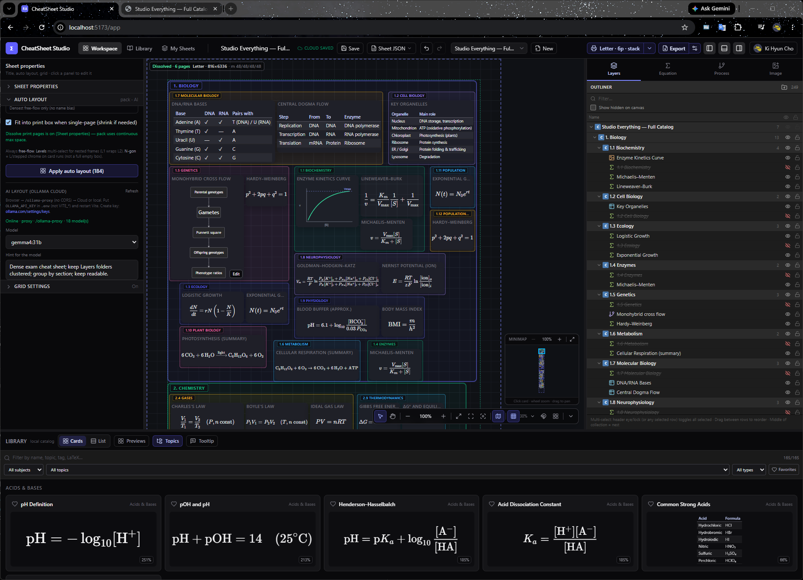

# CheatSheet Studio

<div align="center">

**Math · Science · Economics · Finance cheat-sheet builder**

License: [MIT](./LICENSE) · Status: **active development** (v0.1.0)

</div>

<br />

<div align="center">
  
  <p><em>Workspace: freeform canvas, subject library, properties, and tools</em></p>
</div>

<br />

A Firebase-backed app for building multi-page, print-aware cheat sheets from equations, tables, and figures. Drag items from a curated library onto a freeform board, create custom KaTeX, import images (including seamless GIF loops), organize layers in nested folders, and sync sheets per Google account.

> **Firebase is required for production use.** Auth, Firestore, Storage, and Hosting are part of the product. A built-in seed library loads offline; sign-in, cloud sheets, and durable image upload need a configured Firebase project. Local **Auth emulators** support automated E2E without a real Google login.

---

## Current status (July 2026)

| Area | Status |
|------|--------|
| Core workspace (canvas, library, properties) | **Stable / usable** |
| Multi-page print frames + layout modes | **Implemented** |
| Per-page / printable / whole-board grids | **Implemented** |
| Nested outliner folders + multi-select | **Implemented** |
| Local image persistence (IndexedDB) + Storage promote | **Implemented** |
| GIF ping-pong bake at import | **Implemented** |
| Undo / redo (document history) | **Implemented** |
| Unit + component tests (Vitest) | **~178 tests** |
| E2E smoke + Auth-emulator workspace E2E | **Playwright** |
| Firebase Hosting deploy path | **Supported** (`dist/`) |

**Dev vs Hosting:** `npm run dev` → [http://localhost:5173](http://localhost:5173) serves **live source**. `firebase serve` → [http://localhost:5000](http://localhost:5000) serves **last `npm run build`** only. Rebuild before testing Hosting-style ports.

---

## Features (current functionality)

### Canvas & tools
- Freeform board with **select (V)** and **pan (H)** tools  
- Drag from library, marquee multi-select, multi-move / multi-resize  
- Zoom (in/out/reset), **fit print layout**, **fit content**, focus selection  
- Grid on/off, snap-to-grid, tunable spacing  
- **Grid covers:** Full page · Printable area (margins) · Whole board  
- Soft opacity scale: slider **0–100% → CSS α 0–0.3** (same path for all extents)  
- Auto-organize packs cards into the printable content box  

### Multi-page print frames
- Presets: Letter, Legal, Tabloid, A3/A4/A5 + orientation  
- **1–20 page frames** with vertical / horizontal / grid / **drag-and-place** layouts  
- Margin presets; fit-to-viewport uses the **full multi-page bounds**  
- Page labels and free-layout drag handles  

### Library & content
- Subjects: Mathematics, Physics, Chemistry, Biology, Economics, Finance  
- Built-in **seed catalog** (deduped IDs) + optional Firestore seed  
- Custom equations (KaTeX), markdown tables, figure / image cards  
- Create Equation panel (catalog insert + filters)  
- Import Image panel (preview, local persist, Storage upload when signed in)  
- GIF seamless loop via bake-at-import (avoids Storage CORS reverse-play issues)  

### Layers & organization
- Outliner with **nested folders**, reparent, hide/lock per item or folder  
- Multi-select style/property edits  
- Undo / redo with history batches for continuous drag  

### Account & sheets
- Google sign-in (popup + redirect)  
- Per-user cloud sheets (create, rename, switch, save, delete)  
- Offline fallback: `local_*` sheets when Firestore is unavailable  
- Emulator mode: **Emulator sign-in** (email/password) for local E2E  

### App chrome
| Region | Role |
|--------|------|
| Top bar | Workspace / Library / Sheets, sheet switcher, print menu, undo/redo, save, account |
| Left | Properties — sheet (grid covers, background) or selected card(s) |
| Center | Freeform canvas + print frames |
| Right | Layers · Equation · Image |
| Bottom | Collapsible library by subject / topic |

---

## Stack

| Layer | Tech |
|-------|------|
| UI | React 19, Vite 8, TypeScript, Tailwind CSS v4 |
| State | Zustand (+ persist for UI prefs) |
| Math | KaTeX |
| DnD / layout | @dnd-kit, react-resizable-panels |
| Backend | Firebase Auth, Firestore, Storage, Hosting |
| Tests | Vitest, Testing Library, Playwright |
| Local backend | Firebase Emulators (Auth; optional Firestore/Storage) |

---

## Prerequisites

1. **Node.js** 20+ and npm  
2. A **Firebase project** (production) with:
   - **Authentication** → Google enabled  
   - **Firestore** database  
   - **Storage**  
   - **Web app** config for `.env`  
3. **Firebase CLI** for emulators / deploy: `npm i -g firebase-tools`  
4. (Optional) **Java** only if you run **full** Firestore/Storage emulators  

---

## Setup

### 1. Clone and install

```bash
git clone https://github.com/kevinkicho/cheatsheet_studio.git
cd cheatsheet_studio
npm install
```

### 2. Firebase client config

```bash
cp .env.example .env
```

Fill from **Firebase Console → Project settings → Your apps → Web app**:

| Variable | Description |
|----------|-------------|
| `VITE_FIREBASE_API_KEY` | Web API key |
| `VITE_FIREBASE_AUTH_DOMAIN` | `your-project.firebaseapp.com` |
| `VITE_FIREBASE_PROJECT_ID` | Project ID |
| `VITE_FIREBASE_STORAGE_BUCKET` | Storage bucket |
| `VITE_FIREBASE_MESSAGING_SENDER_ID` | Messaging sender ID |
| `VITE_FIREBASE_APP_ID` | Web app ID |

**Do not commit `.env` or Admin SDK JSON.**

### 3. Console checklist & rules

1. Auth → Google on; authorized domains include `localhost` and Hosting domain  
2. Deploy rules:

```bash
firebase login
firebase use mathstudy071026   # or your project
firebase deploy --only firestore:rules,storage
```

### 4. Run (production Firebase)

```bash
npm run dev
```

Open [http://localhost:5173](http://localhost:5173).

### 5. Run with emulators (local Auth E2E / offline UI)

```bash
# Terminal A — Auth emulator (no Java)
npm run emulators:auth

# Terminal B — app pointed at emulators
npm run dev:emulators
```

Landing shows **Emulator sign-in** (test user is created on first use).  
Full Auth+Firestore+Storage (requires Java):

```bash
npm run emulators
# and set VITE_FIREBASE_EMULATORS_ALL=true when starting the app
```

Optional cloud library seed (Admin SDK JSON in project root — never commit):

```bash
npm run seed
```

---

## Deploy to Firebase Hosting

Hosting serves **`dist/`** only.

```bash
npm run build
firebase deploy --only hosting
```

Or preview Hosting locally after a build:

```bash
npm run build
firebase serve    # http://localhost:5000 — must rebuild to see latest code
```

---

## Scripts

| Command | Description |
|---------|-------------|
| `npm run dev` | Vite dev server (live source) |
| `npm run build` | Production build → `dist/` |
| `npm run preview` | Preview production build |
| `npm test` | Vitest unit + component tests |
| `npm run test:watch` | Vitest watch mode |
| `npm run test:e2e` | Playwright smoke (landing / auth gate) |
| `npm run test:e2e:emulators` | Auth emulator + signed-in workspace E2E |
| `npm run test:e2e:emulators:full` | Auth+Firestore+Storage emulators (needs Java) |
| `npm run test:ci` | `vitest` + `build` |
| `npm run test:all` | Unit + smoke E2E + emulator E2E |
| `npm run emulators` / `emulators:auth` | Start Firebase emulators |
| `npm run dev:emulators` | Vite with emulator env flags |
| `npm run seed` | Seed `libraryItems` via Admin SDK |

---

## Testing

### Unit & component (Vitest + Testing Library)

Covers grid opacity mapping, page layouts, grid coverage exclusivity, print helpers, canvas store (print/items/folders/history), sheets/auth (mocked Firebase), library seed, keyboard shortcuts, Properties / Print menu / sidebars, and more.

```bash
npm test
```

### E2E (Playwright)

```bash
# No Firebase login required
npm run test:e2e

# Signed-in workspace (Auth emulator)
npm run test:e2e:emulators
```

CI (`.github/workflows/ci.yml`) runs unit tests, smoke E2E, Auth-emulator workspace E2E, and production build.

---

## Architecture notes

- **State:** Zustand stores (`canvasStore`, `sheetsStore`, `authStore`, `libraryStore`, `uiStore`)  
- **Print/grid pure logic:** `src/lib/printSizes.ts`, `src/lib/gridCoverage.ts`  
- **Images:** `local-asset:` refs in IndexedDB; promote to Storage on cloud save  
- **Rules:** Sheets private to `ownerId == auth.uid`; system library read-only from client  

---

## Screenshots

<div align="center">
  <table>
    <tr>
      <td align="center" valign="middle">
        
        <br />
        <sub>Main workspace with equation cards and library</sub>
      </td>
    </tr>
  </table>
</div>

---

## Security notes

- Never import Admin credentials into `src/`.  
- Web API keys are public in the browser; **Firestore / Storage rules** protect data.  
- Sheets are private to `ownerId == auth.uid`.  
- Emulator email sign-in is disabled unless `VITE_USE_FIREBASE_EMULATORS` is set.  

---

## License

Released under the [MIT License](./LICENSE).

**Attribution (courtesy):** Product direction and requirements by the project owner; implementation and iteration by **Grok / xAI**.
