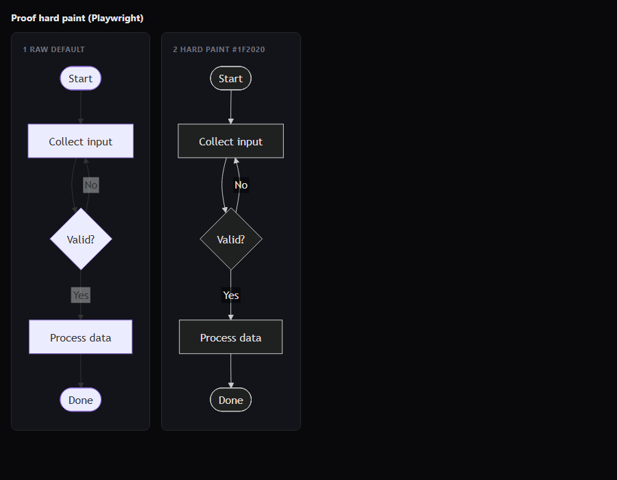
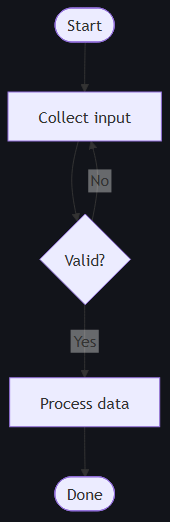
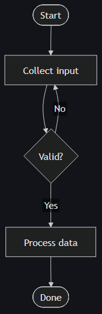

# Proof: hard paint (this build)

Generated: **2026-07-12T01:16:57.993Z**  
Mermaid: **11.16.0**  
Verdict: **PROOF_OK**

## Screenshots (Playwright)

| View | File |
|------|------|
| Full |  |
| Default (expect pale) |  |
| Hard paint #1f2020 (expect dark) |  |

## Pixel scores (host PNG grid)

| Chart | pale | dark | white | near#1f2020 |
|-------|------|------|-------|-------------|
| default | 20 | 39 | 18 | 1 |
| studio hard paint | 1 | 57 | 0 | 18 |

## DOM fills

```json
{
  "def": {
    "fillAttr": "#ECECFF",
    "style": "",
    "computed": "rgb(236, 236, 255)"
  },
  "studio": {
    "fillAttr": "#1f2020",
    "style": "fill: rgb(31, 32, 32) !important; stroke: rgb(204, 204, 204) !important;",
    "computed": "rgb(31, 32, 32)"
  },
  "mermaidVersion": "11.16.0"
}
```

## Checks

- default pale control: **OK**
- studio hard paint dark: **OK**

## Criteria (no false alarm)

Studio only counts as OK if:
1. Host PNG has ≥3 samples near `rgb(31,32,32)` (#1f2020)
2. zero pure-white samples
3. dark count ≥ pale count
4. DOM `fillAttr === '#1f2020'`
