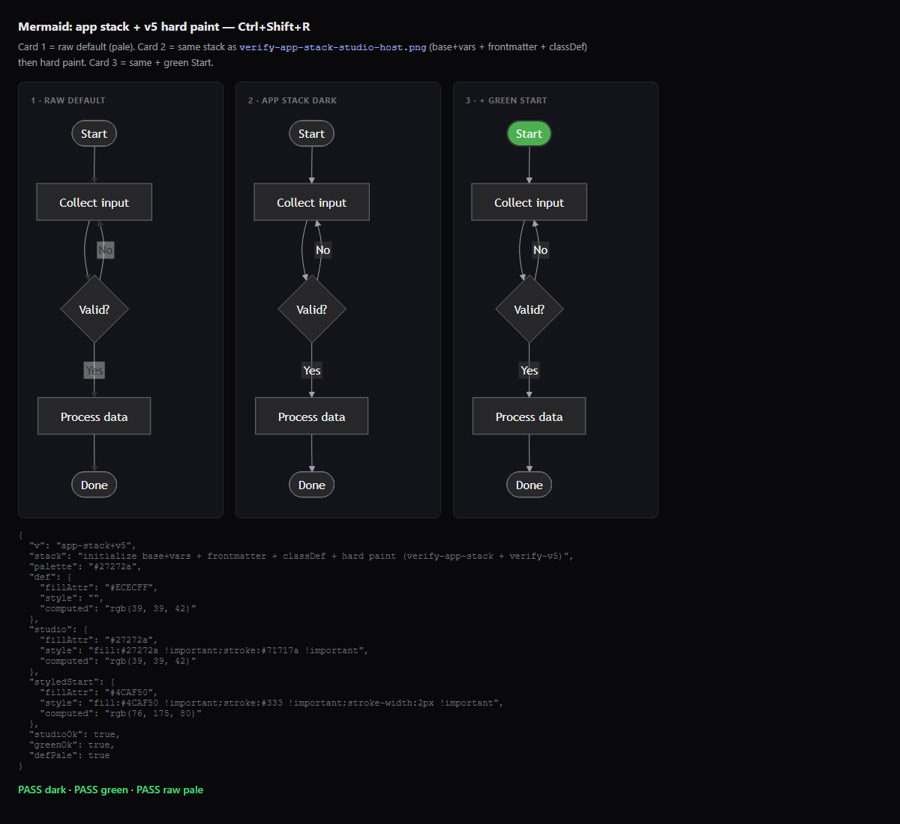
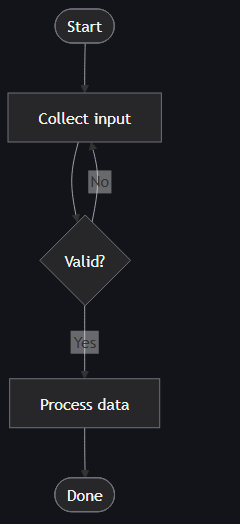
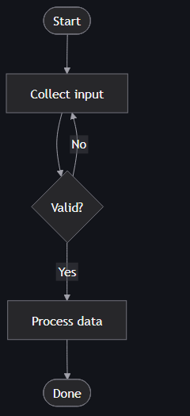
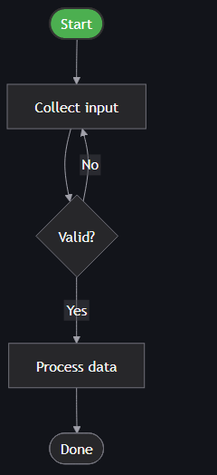

# Proof: live mermaid-test.html

Generated: **2026-07-12T01:31:48.949Z**  
URL: `http://localhost:5002/mermaid-test.html?t=1783819906460`  
HTTP: **200**  
Title: **Mermaid paint — app stack + v5**  
Verdict: **PROOF_FAIL**

## Screenshots (Playwright)

| View | File |
|------|------|
| Full |  |
| Card 1 raw default |  |
| Card 2 hard paint #1f2020 |  |
| Card 3 Start green |  |

## Pixel scores

| Chart | pale | dark | white | near#1f2020 |
|-------|------|------|-------|-------------|
| default | 0 | 59 | 0 | 14 |
| studio hard paint | 0 | 60 | 0 | 14 |
| styled | 2 | 58 | 0 | 12 |

## DOM log

```json
{
  "v": "app-stack+v5",
  "stack": "initialize base+vars + frontmatter + classDef + hard paint (verify-app-stack + verify-v5)",
  "palette": "#27272a",
  "def": {
    "fillAttr": "#ECECFF",
    "style": "",
    "computed": "rgb(39, 39, 42)"
  },
  "studio": {
    "fillAttr": "#27272a",
    "style": "fill:#27272a !important;stroke:#71717a !important",
    "computed": "rgb(39, 39, 42)"
  },
  "styledStart": {
    "fillAttr": "#4CAF50",
    "style": "fill:#4CAF50 !important;stroke:#333 !important;stroke-width:2px !important",
    "computed": "rgb(76, 175, 80)"
  },
  "studioOk": true,
  "greenOk": true,
  "defPale": true
}
```

## Checks

- default pale control: **FAIL**
- studio hard paint dark: **OK**
